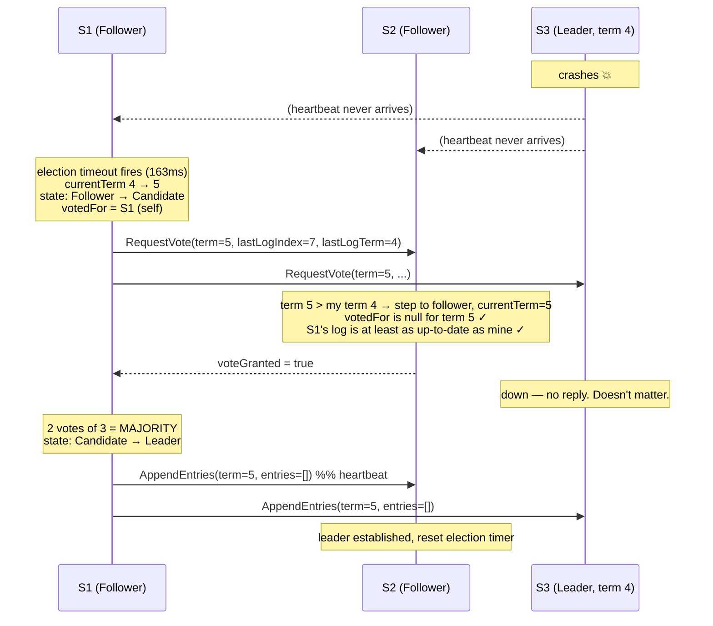

# Raft

> Consensus, explained the way I'd explain it at a whiteboard.
> Three parts: **leader election**, **log replication**, **safety**.

---

## 0. The problem in one paragraph

You have N servers. You want them to behave like **one** highly-reliable server. The trick:
give every server an identical **log** of commands, and a **deterministic** state machine that
executes them in order. Same commands, same order, same starting state ⇒ same final state.
Consensus is just *"keep the logs identical, even when servers crash and the network lies."*

Raft's answer is aggressively simple: **elect one leader, and let it bully everyone else's log
into matching its own.** Every hard question reduces to *"how do we make sure the bully is
trustworthy?"*

---

## 1. The three states

Every server is exactly one of:

- **Follower** — passive. Answers RPCs, never starts anything. This is the default.
- **Candidate** — campaigning. A transient state that lasts one election.
- **Leader** — handles all client writes, replicates them, sends heartbeats.

**Terms** are Raft's logical clock. Time is chopped into numbered terms; each term starts with
an election and has **at most one leader**. Every RPC carries a term number, and this drives
the single most important rule in Raft:

> **If a server sees a term higher than its own, it immediately becomes a follower.**

That one rule kills split-brain. A leader that got partitioned away, then rejoins, sees a
higher term on the first RPC it touches and steps down instantly. It can still *think* it's
the leader for a moment — but it can never get a majority to accept its writes, because the
majority has moved on.

---

## 2. Leader election

### How it starts

Followers expect to hear from the leader. The leader sends **heartbeats** (an empty
`AppendEntries`) on a timer. If a follower hears nothing for its **election timeout**, it
assumes the leader is dead and campaigns:

1. `currentTerm++`
2. become **candidate**
3. **vote for itself**
4. blast `RequestVote` to everyone in parallel

### How it ends — three ways

| Outcome | Trigger |
|---|---|
| **Wins** | Gets votes from a **majority**. Immediately sends heartbeats to shut down any other campaigns. |
| **Loses** | Receives `AppendEntries` from a leader whose term ≥ its own → accepts it, reverts to follower. |
| **Nobody wins** | Split vote — no majority. Times out, bumps the term, tries again. |

**Each server votes at most once per term, first-come-first-served.** Since you need a
*majority* to win and each server has one vote, **two candidates can't both win the same
term.** Quorum intersection does all the work.

### The split-vote problem, and randomization

If everyone times out at the same instant, everyone campaigns, everyone splits the vote, and
you loop forever. Raft's fix is almost embarrassingly simple: **randomize the election
timeout** (e.g. pick fresh from 150–300 ms each time). One server usually wakes up first,
wins, and heartbeats before anyone else stirs. If a split *does* happen, everyone re-rolls
their timer, so a repeat split is exponentially unlikely.

No clever protocol. Just dice.

---

## 3. Diagram: one election cycle

### 3a. Timeline (S3's leader dies; S1 wins the next election)

```
        term 4 ───────────────────────────┼──── term 5 ──────────────────────►
                                          │
S1 (F)  ♥ ─── ♥ ─── ♥ ─── ✗ ✗ ✗ ─[TIMEOUT@163ms]─► CANDIDATE ══► LEADER ── ♥ ── ♥ ──►
                                          │        vote(self)      (2/3 = majority)
                                          │            │  ▲
                                          │  RequestVote│  │voteGranted
                                          │            ▼  │
S2 (F)  ♥ ─── ♥ ─── ♥ ─── ✗ ✗ ✗ ──────────┼───────► [votes for S1] ───► FOLLOWER(t5) ──►
                                          │        (timeout was 271ms —
                                          │         never got to campaign)
                                          │
S3 (L)  ♥───► ♥───► ♥───► ✗ CRASH ✗       │        ✗ (down)
        (leader, term 4)                  │
                                          │
                                    leader dies
♥ = heartbeat   ✗ = missed heartbeat
```

Note the key detail: **S2 never even campaigns.** Its random timeout (271 ms) was longer than
S1's (163 ms), so S1 got there first and S2's timer got reset by S1's `RequestVote`. That's
randomization doing its job.

### 3b. Message flow



### 3c. The state machine

```
                  ┌──────────────────────────────────────────────┐
                  │        discovers server with higher term      │
                  ▼                                              │
            ┌──────────┐   election timeout    ┌───────────┐     │
  start ───►│ FOLLOWER │──────────────────────►│ CANDIDATE │     │
            └──────────┘   term++, vote self   └───────────┘     │
                  ▲                              │      │        │
                  │  discovers current leader    │      │ wins   │
                  │  OR higher term              │      │ majority
                  └──────────────────────────────┘      ▼        │
                                                   ┌────────┐    │
                       split vote → timeout        │ LEADER │────┘
                       → new term, retry           └────────┘
                              ↺ (candidate → candidate)
```

---

## 4. Log replication

Once elected, the leader does the boring, useful work.

**The happy path:**

1. Client sends a command → **the leader** (followers just redirect).
2. Leader **appends** it to its own log. Each entry stores `{command, term, index}`.
3. Leader sends `AppendEntries` to all followers, in parallel.
4. When a **majority** have stored it, the entry is **committed**.
5. Leader **applies** it to its state machine and replies to the client.
6. Leader piggybacks its `commitIndex` on later `AppendEntries`, so followers apply it too.

**Committed** is the promise: *this entry will eventually be executed by every live server, and
can never be lost.* Note the leader doesn't wait for slow followers — a majority is enough, so
one sick node doesn't slow the cluster.

### The Log Matching Property — the load-bearing invariant

> If two logs contain an entry with the **same index and same term**, then (a) they hold the
> same command, and (b) **all preceding entries are identical too**.

Part (a) is free: a leader creates at most one entry per (index, term), and never modifies its
own log — it only appends.

Part (b) is enforced by a two-field trick. Every `AppendEntries` carries `prevLogIndex` and
`prevLogTerm` — describing the entry *just before* the new ones. **The follower rejects the
request unless it has an entry matching that index+term.**

That's an induction proof hiding in an RPC. Logs start empty (base case). Every successful
append preserves the property (inductive step). So *a successful `AppendEntries` proves the
follower's entire log prefix is identical to the leader's*. Enormous guarantee, two fields.

### Repairing broken logs

After crashes, a follower can be missing entries, have extra garbage entries, or both, across
multiple terms. Raft's philosophy:

> **The leader is right. Followers get overwritten.**

The leader tracks `nextIndex[follower]`, starting optimistically at its own last index + 1. If
`AppendEntries` fails the consistency check, it **decrements `nextIndex` and retries** — walking
backwards until it finds the last point where the logs agree. The follower then **truncates**
everything after that and copies the leader's entries.

Two lovely consequences:
- **A new leader needs no special recovery procedure.** It just starts sending `AppendEntries`
  and the logs converge on their own.
- **A leader never deletes or overwrites its *own* log.** Only followers get rewritten.

(Optimization: the follower can report the *term* of the conflicting entry, letting the leader
skip a whole term in one round trip instead of backing up one index at a time.)

---

## 5. Safety

Log replication alone is **broken**. Picture it: a follower is offline while the leader commits
entries 5, 6, 7. The follower comes back, gets elected (it doesn't know it's behind), and
overwrites 5–7 with its own stale log. Committed data — data a client was told was durable —
is gone.

Raft plugs this with **two** rules.

### Rule 1: the Election Restriction — *"you can't lead if you're behind"*

> **A candidate can't win unless its log is at least as up-to-date as the voter's.**

Implemented for free inside `RequestVote`: the candidate sends `lastLogIndex` + `lastLogTerm`,
and **a voter refuses if its own log is more up-to-date.**

**"Up-to-date" comparison (get this right):**
1. **Compare the last entry's TERM.** Higher term wins.
2. **Only if terms tie, compare LENGTH.** Longer wins.

Term first, *then* index. A long log stuffed with uncommitted junk from term 2 **loses** to a
short log holding one entry from term 5.

**Why it's airtight:** a committed entry lives on a majority. A winner needs a majority. **Two
majorities always intersect.** So at least one voter *has* the committed entry — and it will
refuse to vote for anyone missing it. Therefore **every leader already holds every committed
entry.** (This is the *Leader Completeness* property — and it's what makes "the leader is
right" safe.)

### Rule 2: don't commit old entries by counting replicas

**The subtle one. This is the trap.**

The naive rule — *"committed once it's on a majority"* — is **wrong for entries created by a
previous leader.**

The failure: a new leader re-replicates an old-term entry to a majority, then crashes before
committing anything of its own. A *different* server can now legitimately win the next election
(its log is more up-to-date by the term-first rule) and **overwrite that entry — even though it
sat on a majority.** If someone had called it committed, safety is violated.

**Raft's rule:**

> **A leader only counts replicas to commit entries from its OWN current term.**
> **Older entries get committed *indirectly*, once a current-term entry commits.**

Log Matching does the rest: committing index `i` transitively commits everything before `i`.

**Practical upshot:** a freshly-elected leader immediately appends a **no-op entry** in its own
term. Committing that no-op sweeps all inherited entries into the committed zone — and only
*then* can it safely serve reads. Every real implementation does this.

### The five properties, all together

| Property | Meaning |
|---|---|
| **Election Safety** | ≤ 1 leader per term. *(one vote per server + majority)* |
| **Leader Append-Only** | A leader only appends to its own log; never overwrites or deletes. |
| **Log Matching** | Same index + same term ⇒ identical logs up to that point. |
| **Leader Completeness** | A committed entry is present in every future leader's log. *(election restriction)* |
| **State Machine Safety** | No two servers ever apply *different* commands at the same index. |

The chain: *Election Restriction ⇒ Leader Completeness ⇒ State Machine Safety.* That's the
whole safety argument.

---

## 6. The things that will bite you in an implementation

- **Persist `currentTerm`, `votedFor`, and `log[]` before replying to any RPC.** Forget
  `votedFor` and a server can crash, restart, and vote **twice in one term** → two leaders.
- **Up-to-date = term first, then index.** Reversing this is a silent safety bug.
- **You cannot commit a previous term's entry by counting replicas.** No-op on election.
- **RPCs are idempotent and retried forever.** That's the entire handling of follower crashes.
- **Timing affects liveness, never safety.** But you need
  `broadcastTime << electionTimeout << MTBF`. If your fsync is slow or you're across a WAN,
  an aggressive election timeout causes **leader flapping** and makes availability *worse*.
- **`2f+1` servers survive `f` failures.** 3 → 1, 5 → 2. Even-numbered clusters buy nothing:
  4 servers still only tolerate 1.

---

## 7. One-line summary

**Elect exactly one leader per term using majority votes; only elect someone whose log already
contains everything committed; then let that leader overwrite everyone else's log with its
own — and never claim an inherited entry is committed until you've committed one of your own.**