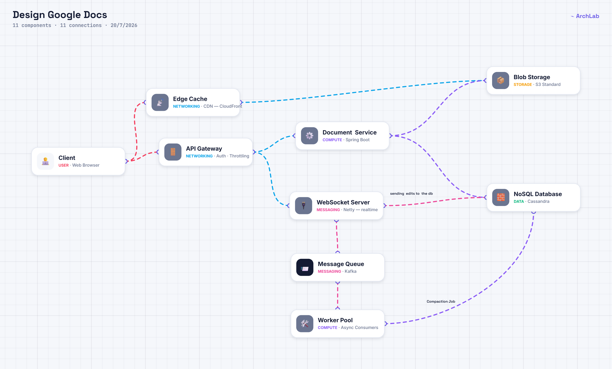

# Design a collaborative editing system like Google Docs

## Gathering Requirements

### Functional

- users should be  able to CRUD documents
- multiple users should  be able to concurrently edit the same doc
- updates should be visible in real time 
- cursor position - avoid conflicts

### Non functional  requirements

- million of documents
- 100 concurrent users oer document 
- latency <= 200ms  
- document to converge  and  be  consistent 
- average doc size is  100kb

## API Design

`POST /api/documents`

 `GET /api/documents/{documentId}`

`PUT /api/documents/{documentId}`

`WS /api/documents/{documentId}/collaborate`

## High Level Design

- it is very expensive to update the  whole  document  
- updates should be  quick  
- database should contains only the  eidts
- Conflicts   ?  
Client consistency is  important here   
- Operational Transform  technique  - for insertions of      edits to take  place  efficiently do it on the  client side and the server side also 
- LWW  
- CRDT - Conflict Replicated data Type
- when a other user joined late all the  previoud edits should  converge and updated in the  local document of the user 
- compaction job send by WebSocket to async workers  
- scaling websockets is not trvial : they are stateful use  routing the  users using docId - consistent hashing can be used.
- rate limiting on the client side

## Deep Dives

- read about CRDT , OT , compaction jobs of eidts

